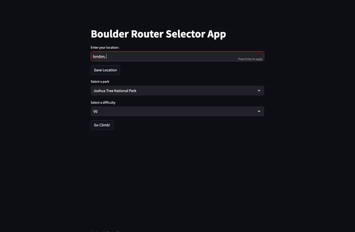

# LangChain Climbing Selector
---


# Motivation
The goal is to have a tool to help climbers to
- select nearby outdoor boulder park
- select boulder problems based on their climbing level
- make some recommended boulder problems in a tabular format

# Installation

The python version used is `3.10.12` and please install the dependencies with the following command:

> Note: This mini project is dedicated to understand the basics of LangChain. The dependencies are not optimized for production.

```bash
pip install -r requirements.txt
```

# Usage

Please deploy it locally with the following command:
```bash
streamlit run ./src/main.py
```

# Reference
- [read the docs langchain](https://readthedocs.org/projects/langchain/)